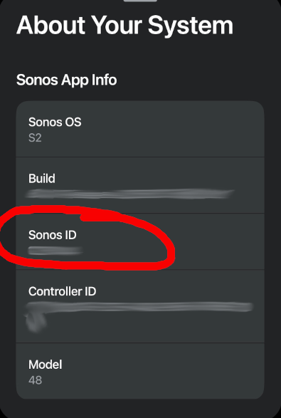

= Setting up Sonos Service

Credit goes to https://github.com/wkulhanek[@wkulhanek] for writing up these instructions and providing the navidrome artwork.

== Prerequisites
* In your Sonos App get your Sonos ID (About my Sonos System)
+

* Navidrome running and available from the server that Bonob is running on. This can be a public URL like https://music.mydomain.com or just a local URL like http://192.168.1.100:4533.
* Bonob running and available from the Internet. E.g. via https://bonob.mydomain.com

You can use any method to make these URLs available. Cloudflare Tunnels, Pangolin, reverse proxy, etc.

== Sonos Service Integration

* Log into https://play.sonos.com
* Once logged in go to https://developer.sonos.com/s/integrations

* Create a *New Content Integration*

** General Information
*** Service Name: Navidrome
*** Service Availability: Global
*** Checkbox checked
*** Website/Social Media URLs: https://music.mydomain.com (Some URL - e.g. your Navidrome server). This has to be a valid URL.

** Sonos Music API
*** Integration ID: com.mydomain.music (your domain in reverse)
*** Configuration Label: 1.0
*** SMAPI Endpoint: https://bonob.mydomain.com/ws/sonos
*** SMAPI Endpoint Version: 1.1
*** Radio Endpoint: empty
*** Reporting Endpoint: https://bonob.mydomain.com/report
*** Reporting Endpoint Version: 2.1
*** Authentication Method: OAuth
*** Redirect: https://bonob.mydomain.com/login
*** Auth Token Time To Life: Empty
*** Browse/Search Results Page Size: 100
*** Polling Interval: 60

** Brand Assets

*** Just upload the various assets from the `docs/sonos_service/sonos_artwork` directory.

** Localization Resources

*** Write something about your service in the various fields (except Explicit Filter Description).

** Integration Capabilities

*** Check the first two (*Enable Extended Metadata* and *Enable Extended Metadata for Playlists*) and nothing else.

** Image Replacement Rules

*** Pattern: \/size\/(?<size>\d+)
*** Name: 60
*** Replacement Text: /size/60.png
*** Minimum & Maximum Scales: Empty
*** Add Replacement Rule
*** Name: 80
*** Replacement Text: /size/80.png
*** Minimum & Maximum Scales: Empty

Should look like this:
image::s2ImagePatterns.png[]

Repeat for the following resolutions; 60,80,120,180,192,200,230,300,600,640,750,1000,1242,1500

json in the Service Configuration should look like this.

[source,json]
----
"image-replacement-rules" : {
    "pattern" : "\\/size\\/(?<size>\\d+)",
    "replacements" : [ {
        "name" : "60",
        "replacement" : "/size/60.png"
    }, {
        "name" : "80",
        "replacement" : "/size/80.png"
    }, {
        "name" : "120",
        "replacement" : "/size/120.png"
    }, {
        "name" : "180",
        "replacement" : "/size/180.png"
    }, {
        "name" : "192",
        "replacement" : "/size/192.png"
    }, {
        "name" : "200",
        "replacement" : "/size/200.png"
    }, {
        "name" : "230",
        "replacement" : "/size/230.png"
    }, {
        "name" : "300",
        "replacement" : "/size/300.png"
    }, {
        "name" : "600",
        "replacement" : "/size/600.png"
    }, {
        "name" : "640",
        "replacement" : "/size/640.png"
    }, {
        "name" : "750",
        "replacement" : "/size/750.png"
    }, {
        "name" : "1000",
        "replacement" : "/size/1000.png"
    }, {
        "name" : "1242",
        "replacement" : "/size/1242.png"
    }, {
        "name" : "1500",
        "replacement" : "/size/1500.png"
    } ]
},
----

** Browse Options

*** No changes

** Search Capabilities

*** API Catalog Type: SMAPI Catalog
*** Catalog Title: Music
*** Catalog Type: GLOBAL

*** Add Three Categories with ID and Mapped ID:
+
Albums - albums
Artists - artists
Tracks - tracks

** Content Actions

*** No changes

** Service Deployment Settings

*** Sonos ID: Your Sonos ID (Sonos S2 app -> System Settings -> Manage -> About your system -> "Sonos ID"). This is how only your controller sees the new service.
*** System Name: Whatever you want

** Service Configuration

*** Click on *Refresh* and then *Send*. You should get a success message that you can dismiss with *Done*.

* In your app search for your service name and add Service in your app as usual.
